# Set 6 - Additive (Drawbar)

This is a wavetable set for [Plinky](http://www.plinkysynth.com/), for use with the wavetable generator.

You will find a compiled `wavetab.uf2` file in this folder that you can upload to Plinky in tunnel-of-lights mode. The process is similar to [uploading firmware to Plinky](
https://plinkysynth.com/docs/build-guide-black#firmware). To revert back to the original wavetables, install `wavetab.uf2` from the folder **01_Originial_Miunau**.

Format of the wav files in this folder:

- single cycle waveform
- 48 kHz
- 2048 samples (the tool resamples them to 512)
- 16 bits
- mono

The generator downsamples the waves for Plinky (32kHz) and generates various octaves pre-filtered.

## Waveshapes

This set was generated with an additive generator. Think of it working like a drawbar organ, in that it lets you set an individual volume for each overtone / harmonic. The bottom graphic represents the overtones in whole-number steps, and the top graphic represents the resulting waveform.

In this set, the waves resemble organ tones, each with an individual mix of overtones.

In higher registers, this bank has an organ sound to it.

These are the waveshapes in this folder:

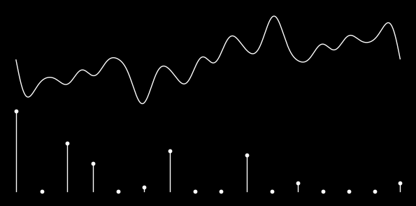

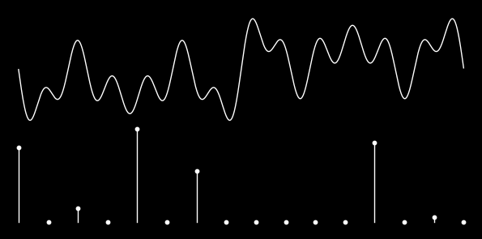

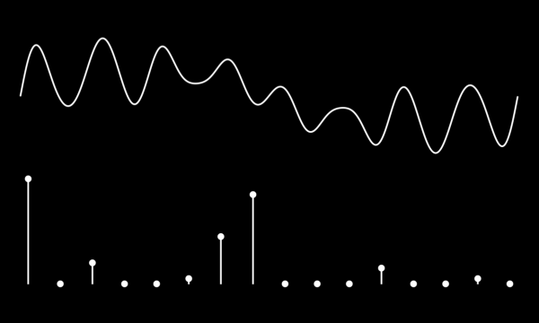

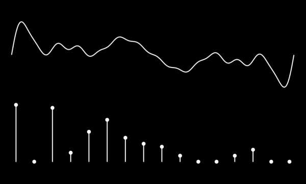

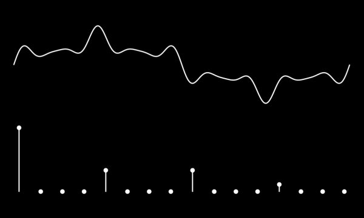

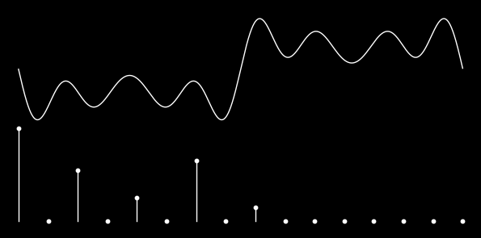

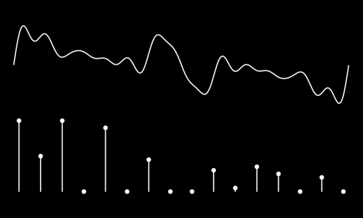

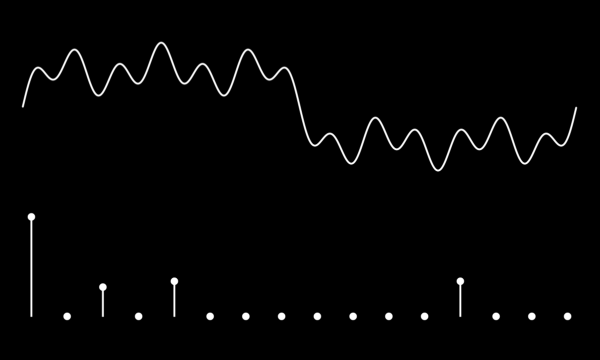

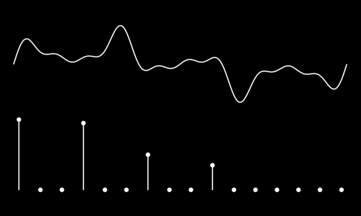

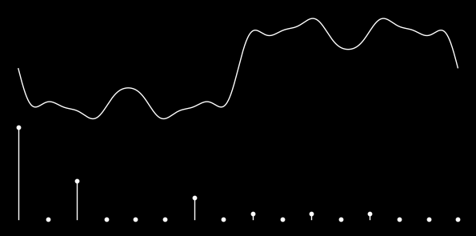

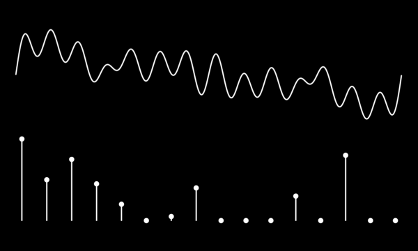

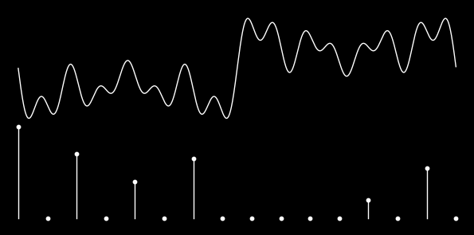

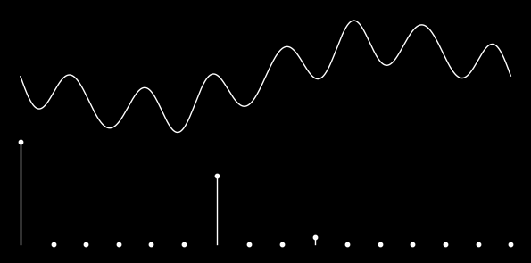

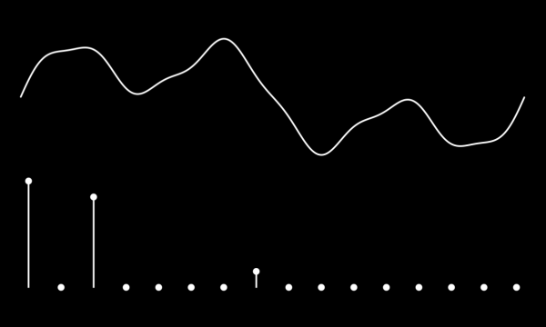

### wavetab.uf2

Generated `wavetab.uf2` which you can just toss over to plinky! yay!

## wavetable.h

Generated `wavetable.h` which you can use in the main Plinky project. Copy it to `Core/Src/wavetable.h` and recompile the Plinky firmware.

## Preset

Try this with a basic preset so you can clearly hear what the waves are doing.

Here's a preset to use with the [browser-based patch editor](
https://plinkysynth.github.io/editor/?p=AT4DAesEBRSATpmAAgGAAgGAAgGAAgHADAF0AgGAAgE8CAEVDwFkCwHFBQKAqgYDwAADCgUCAgABBAIEAgABBAMJAQQBAgABAgEBBQIEAgIJAQIEAgQAAgICCAECBQECBQMCAAICAgQCAgH.AgECAgEDAgECAwICATQB-CwBCDMBAf8AUAECDAECUwECSwGZFAFQSgICAhQBbGADaQADXgFuYAFrYAF5wg__)

- Knob A: Sensitivity / Drive (turn this up at least a little)
- Knob B: LFO

Set Shift-Up, select Shape to put Shape on the Encoder and left hand fader strip to experiment with the waveshape.

## Credits

- Code: [@mmalex](https://twitter.com/mmalex)
- Core wavetable waves: [@miuott](https://twitter.com/miuott)
- This wavetable pack: [Making Sound Machines](https://makingsoundmachines.com/)