# Set 7 - Phase (Vowels)

This is a wavetable set for [Plinky](http://www.plinkysynth.com/), for use with the wavetable generator.

You will find a compiled `wavetab.uf2` file in this folder that you can upload to Plinky in tunnel-of-lights mode. The process is similar to [uploading firmware to Plinky](
https://plinkysynth.com/docs/build-guide-black#firmware). To revert back to the original wavetables, install `wavetab.uf2` from the folder **01_Originial_Miunau**.

Format of the wav files in this folder:

- single cycle waveform
- 48 kHz
- 2048 samples (the tool resamples them to 512)
- 16 bits
- mono

The generator downsamples the waves for Plinky (32kHz) and generates various octaves pre-filtered.

## Waveshapes

This set was generated with the Phaseshaping Oscillator of [Fors Glänta](https://fors.fm/chiral). Chiral is a great Max for Live plugin developed by Ess Mattisson and Felisha Ledesma, and it has a feature that lets you export single cycle waveshapes.

This set sweeps through the overtones in a manner that results in very vowel-y, vocal sounds.

These are the waveshapes in this folder:

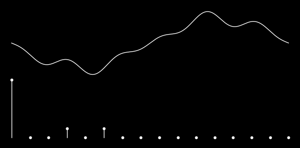

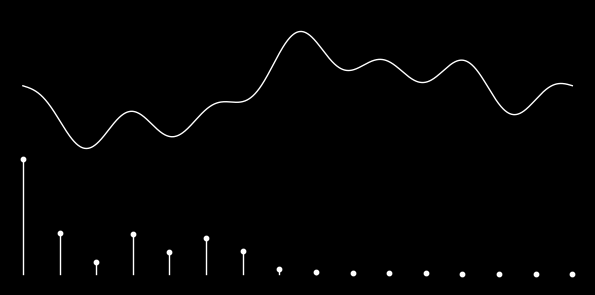

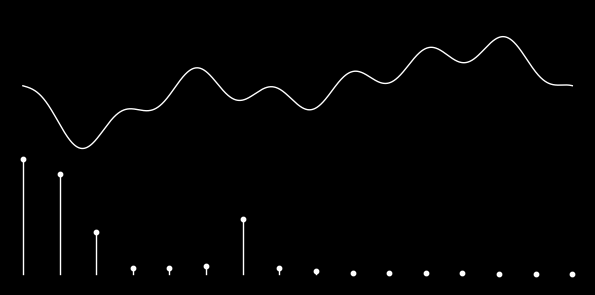

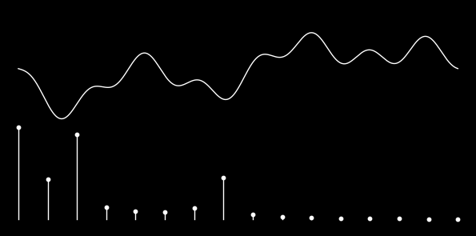

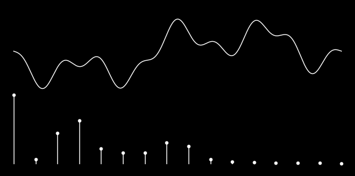

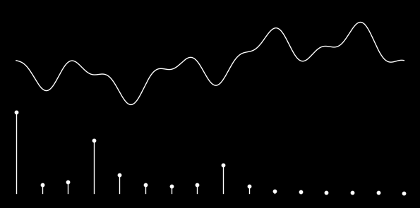

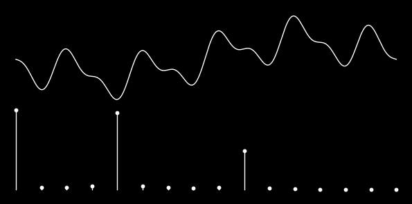

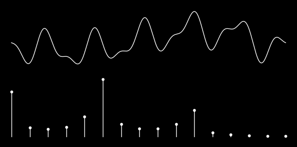

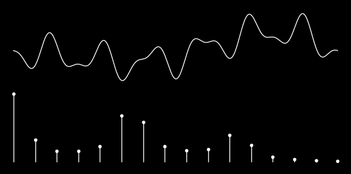

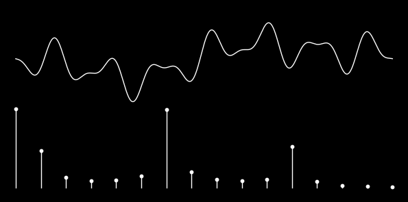

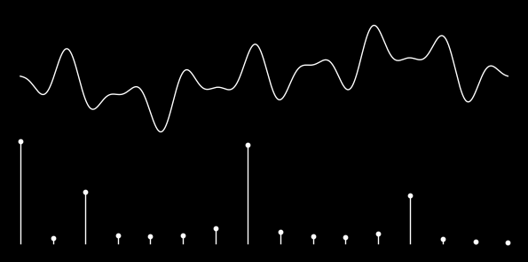

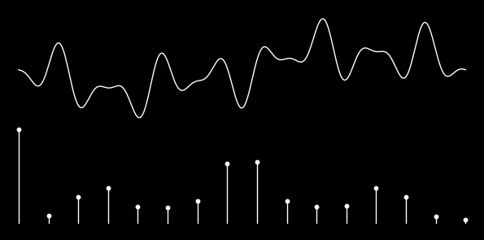

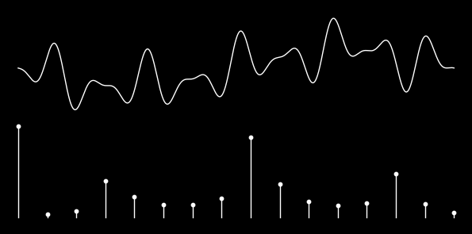

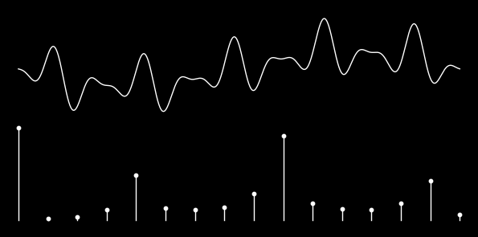

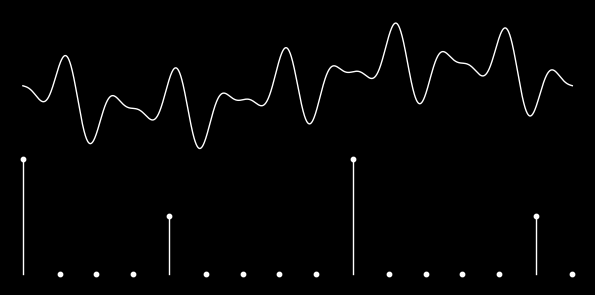

### wavetab.uf2

Generated `wavetab.uf2` which you can just toss over to plinky! yay!

## wavetable.h

Generated `wavetable.h` which you can use in the main Plinky project. Copy it to `Core/Src/wavetable.h` and recompile the Plinky firmware.

## Preset

Try this with a basic preset so you can clearly hear what the waves are doing.

Here's a preset to use with the [browser-based patch editor](
https://plinkysynth.github.io/editor/?p=AVwDAaQEBRIzTpmAAgGAAgGAAgGAAgHADAF0AgGAAgEhCAFACgG6BAIBLgoCxboFAaoGAcAMBQICAAEEAgQCAAEEAwkBBAECAAECAQEFAgQCAgsBAQQCBAACAgIAAgYBAgUBBAMFAgACAAICBQQCAAT.AgECBQECAwMCAQlgAQhhAaMGATP-ABsBAgwBAlMBAksBmRQBVkoCAgIUAW9gA3cAA14BZWABbGABc8I_)

- Knob A: Sensitivity / Drive (turn this up at least a little)
- Knob B: LFO
- Touch: mapped to timbre

Set Shift-Up, select Shape to put Shape on the Encoder and left hand fader strip to experiment with the waveshape.

## Credits

- Code: [@mmalex](https://twitter.com/mmalex)
- This wavetable pack: [Making Sound Machines](https://makingsoundmachines.com/)